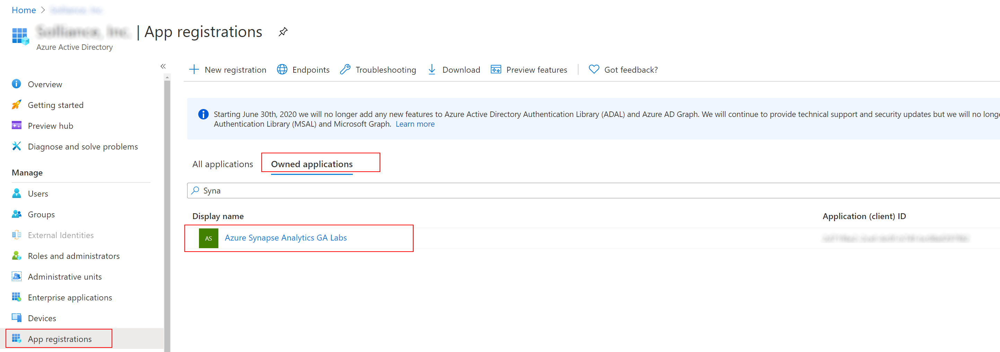
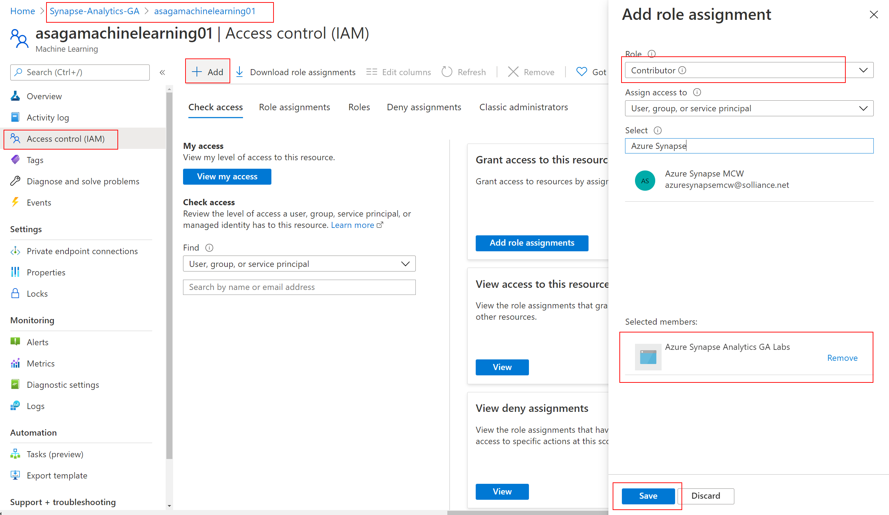
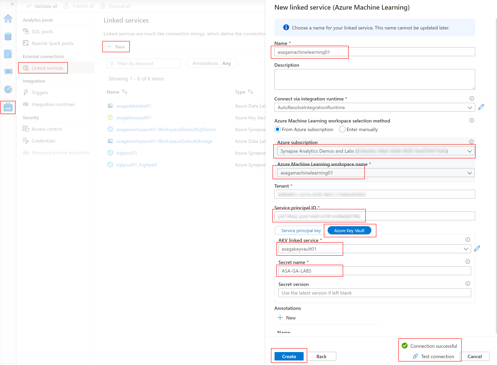
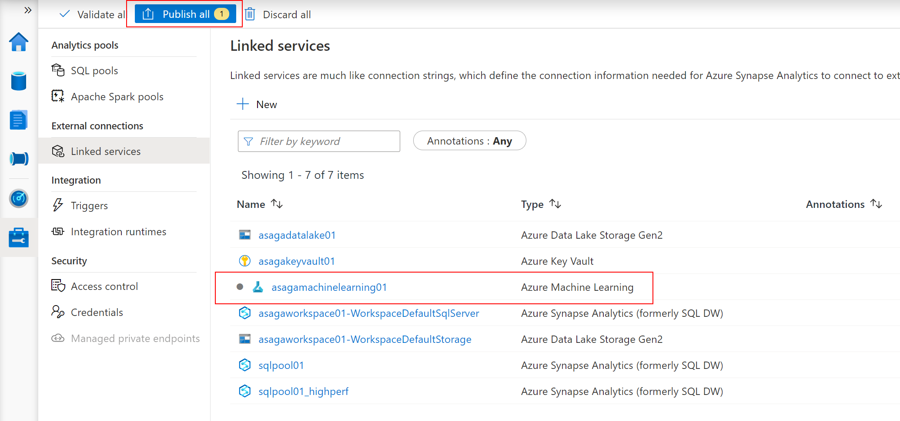

# Lab 01 - The Integrated Machine Learning Process in Synapse Analytics

This lab demonstrates the integrated, end-to-end Azure Machine Learning and Azure Cognitive Services experience in Azure Synapse Analytics. You will learn how to connect an Azure Synapse Analytics workspace to an Azure Machine Learning workspace using a Linked Service and then trigger an Automated ML experiment that uses data from a Spark table. You will also learn how to use trained models from Azure Machine Learning or Azure Cognitive Services to enrich data in a SQL pool table and then serve prediction results using Power BI.

After completing the lab, you will understand the main steps of an end-to-end Machine Learning process that build on top of the integration between Azure Synapse Analytics and Azure Machine Learning.

This lab has the following structure:

- [Before the hands-on lab](#before-the-hands-on-lab)
  - [Task 1 - Create and configure the Azure Synapse Analytics workspace](#task-1---create-and-configure-the-azure-synapse-analytics-workspace)
  - [Task 2 - Create and configure additional resources for this lab](#task-2---create-and-configure-additional-resources-for-this-lab)
- [Exercise 1 - Create an Azure Machine Learning linked service](#exercise-1---create-an-azure-machine-learning-linked-service)
  - [Task 1 - Create and configure an Azure Machine Learning linked service in Synapse Studio](#task-1---create-and-configure-an-azure-machine-learning-linked-service-in-synapse-studio)
  - [Task 2 - Explore Azure Machine Learning integration features in Synapse Studio](#task-2---explore-azure-machine-learning-integration-features-in-synapse-studio)
- [Exercise 2 - Trigger an Auto ML experiment using data from a Spark table](#exercise-2---trigger-an-auto-ml-experiment-using-data-from-a-spark-table)
  - [Task 1 - Create a Spark table on top of data from the Data Lake](#task-1---create-a-spark-table-on-top-of-data-from-the-data-lake)
  - [Task 2 - Trigger a regression Auto ML experiment on a Spark table](#task-2---trigger-a-regression-auto-ml-experiment-on-a-spark-table)
  - [Task 3 - View experiment details in Azure Machine Learning workspace](#task-3---view-experiment-details-in-azure-machine-learning-workspace)
- [Exercise 3 - Enrich data in a SQL pool table using a trained model](#exercise-3---enrich-data-in-a-sql-pool-table-using-a-trained-model)
  - [Task 1 - Enrich data in a SQL pool table using a trained model from Azure Machine Learning](#task-1---enrich-data-in-a-sql-pool-table-using-a-trained-model-from-azure-machine-learning)
  - [Task 2 - Enrich data in a SQL pool table using a trained model from Azure Cognitive Services](#task-2---enrich-data-in-a-sql-pool-table-using-a-trained-model-from-azure-cognitive-services)
  - [Task 3 - Integrate a Machine Learning-based enrichment procedure in a Synapse pipeline](#task-3---integrate-a-machine-learning-based-enrichment-procedure-in-a-synapse-pipeline)
- [Exercise 4 - Serve prediction results using Power BI](#exercise-4---serve-prediction-results-using-power-bi)
  - [Task 1 - Create a view on top of a prediction query](#task-1---create-a-view-on-top-of-a-prediction-query)
  - [Task 2 - Display prediction results in a Power BI report](#task-2---display-prediction-results-in-a-power-bi-report)
  - [Task 3 - Trigger the pipeline using an event-based trigger](#task-3---trigger-the-pipeline-using-an-event-based-trigger)
- [After the hands-on lab](#after-the-hands-on-lab)
- [Resources](#resources)

## Before the hands-on lab

Before stepping through the exercises in this lab, make sure you have properly configured your Azure Synapse Analytics workspace. Perform the tasks below to configure the workspace.

### Task 1 - Create and configure the Azure Synapse Analytics workspace

>**NOTE**
>
>If you have already created and configured the Synapse Analytics workspace while running one of the other labs available in this repo, you must not perform this task again and you can move on to the next task. The labs are designed to share the Synapse Analytics workspace, so you only need to create it once.

Follow the instructions in [Deploy your Azure Synapse Analytics workspace](./../setup/asa-workspace-deploy.md) to create and configure the workspace.

### Task 2 - Create and configure additional resources for this lab

Follow the instructions in [Deploy resources for Lab 01](./../setup/lab-01-deploy.md) to deploy additional resources for this lab. Once deployment is complete, you are ready to proceed with the exercises in this lab.

## Exercise 1 - Create an Azure Machine Learning linked service

In this exercise, you will create and configure an Azure Machine Learning linked service in Synapse Studio. Once the linked service is available, you will explore the Azure Machine Learning integration features in Synapse Studio.

### Task 1 - Create and configure an Azure Machine Learning linked service in Synapse Studio

The Synapse Analytics linked service authenticates with Azure Machine Learning using a service principal. The service principal is based on an Azure Active Directory application named `Azure Synapse Analytics GA Labs` and has already been created for you by the deployment procedure. The secret associated with the service principal has also been created and saved in the Azure Key Vault instance, under the `ASA-GA-LABS` name.

>**NOTE**
>
>In the labs provided by this repo, the Azure AD application is used in a single Azure AD tenant which means it has exactly one service principal associated to it. Consequently, we will use the terms Azure AD application and service principal interchangeably. For a detailed explanation on Azure AD applications and security principals, see [Application and service principal objects in Azure Active Directory](https://docs.microsoft.com/en-us/azure/active-directory/develop/app-objects-and-service-principals).

To view the service principal, open the Azure portal and navigate to your instance of Azure Active directory. Select the `App registrations` section and you should see the `Azure Synapse Analytics GA Labs` application under the `Owned applications` tab.

Select the application to view its properties and copy the value of the `Application (client) ID` property (you will need it in a moment to configure the linked service).

To view the secret, open the Azure Portal and navigate to the Azure Key Vault instance that has been created in your resource group. Select the `Secrets` section and you should see the `ASA-GA-LABS` secret:

First, you need to make sure the service principal has permissions to work with the Azure Machine Learning workspace. Open the Azure Portal and navigate to the Azure Machine Learning workspace that has been created in your resource group. Select the `Access control (IAM)` section on the left, then select `+ Add` and `Add role assignment`. In the `Add role assignment` dialog, select the `Contributor` role, select `Azure Synapse Analytics GA Labs` service principal, and the select `Save`.

You are now ready to create the Azure Machine Learning linked service.

To create a new linked service, open Synapse Studio, select the `Manage` hub, select `Linked services`, and the select `+ New`. In the search field from the `New linked service` dialog, enter `Azure Machine Learning`. Select the `Azure Machine Learning` option and then select `Continue`.

In the `New linked service (Azure Machine Learning)` dialog, provide the following properties:

- Name: enter `asagamachinelearning01`.
- Azure subscription: make sure the Azure subscription containing your resource group is selected.
- Azure Machine Learning workspace name: make sure your Azure Machine Learning workspace is selected.
- Notice how `Tenant identifier` has been already filled in for you.
- Service principal ID: enter the application client ID that you copied earlier.
- Select the `Azure Key Vault` option.
- AKV linked service: make sure your Azure Key Vault service is selected.
- Secret name: enter `ASA-GA-LABS`.

Next, select `Test connection` to make sure all settings are correct, and then select `Create`. The Azure Machine Learning linked service will now be created in the Synapse Analytics workspace.

>**IMPORTANT**
>
>The linked service is not complete until you publish it to the workspace. Notice the indicator near your Azure Machine Learning linked service. To publish it, select `Publish all` and then `Publish`.

### Task 2 - Explore Azure Machine Learning integration features in Synapse Studio

Task content

## Exercise 2 - Trigger an Auto ML experiment using data from a Spark table

Exercise description

### Task 1 - Create a Spark table on top of data from the Data Lake

Task content

### Task 2 - Trigger a regression Auto ML experiment on a Spark table

Task content

### Task 3 - View experiment details in Azure Machine Learning workspace

Task content (includes viewing an already registered model in the workspace and its details)

## Exercise 3 - Enrich data in a SQL pool table using a trained model

Exercise description

### Task 1 - Enrich data in a SQL pool table using a trained model from Azure Machine Learning

Task description

### Task 2 - Enrich data in a SQL pool table using a trained model from Azure Cognitive Services

Task description

### Task 3 - Integrate a Machine Learning-based enrichment procedure in a Synapse pipeline

Task description

## Exercise 4 - Serve prediction results using Power BI

Exercise description

### Task 1 - Create a view on top of a prediction query

Task description

### Task 2 - Display prediction results in a Power BI report

Task description

### Task 3 - Trigger the pipeline using an event-based trigger

New data has landed in the Data Lake

## After the hands-on lab

Follow the instructions in [Clean-up your subscription](./../setup/cleanup.md) to clean-up your environment after the hands-on lab.

## Resources

To learn more about the topics covered in this lab, use these resources:

- [Quickstart: Create a new Azure Machine Learning linked service in Synapse](https://docs.microsoft.com/en-us/azure/synapse-analytics/machine-learning/quickstart-integrate-azure-machine-learning)
- [Tutorial: Machine learning model scoring wizard for dedicated SQL pools](https://docs.microsoft.com/en-us/azure/synapse-analytics/machine-learning/tutorial-sql-pool-model-scoring-wizard)