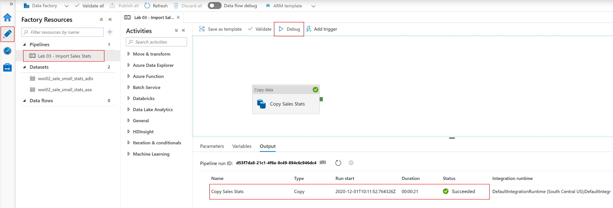
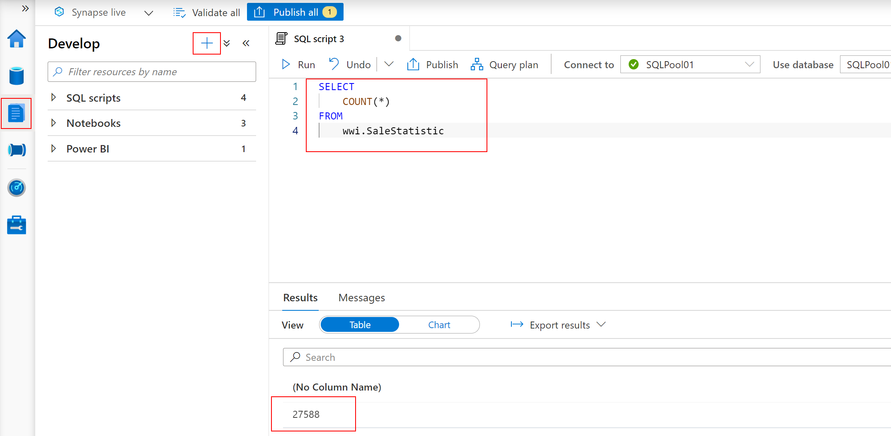

# Lab 03 - Migrating Data Factory Pipelines to Synapse Analytics Pipelines

This lab demonstrates the experience of migrating an existing Azure Data Factory pipeline to an Azure Synapse Analytics Pipeline. You will learn how to script major ADF artifacts like linked services, datasets, activities, and pipelines. You will also learn how to import these artifacts into Azure Synapse Analytics. In the end, you will learn to validate, test, and trigger the imported Azure Synapse Pipeline.

After completing the lab, you will understand the main steps of a migration process from Azure Data Factory pipelines to Azure Synapse Analytics pipelines.

This lab has the following structure:

- [Before the hands-on lab](#before-the-hands-on-lab)
  - [Task 1 - Create and configure the Azure Synapse Analytics workspace](#task-1---create-and-configure-the-azure-synapse-analytics-workspace)
  - [Task 2 - Create and configure additional resources for this lab](#task-2---create-and-configure-additional-resources-for-this-lab)
- [Exercise 1 - Script an Azure Data Factory (ADF) pipeline](#exercise-1---script-an-azure-data-factory-adf-pipeline)
  - [Task 1 - View and run the ADF pipeline](#task-1---view-and-run-the-adf-pipeline)
  - [Task 2 - Script an ADF linked service](#task-2---script-an-adf-linked-service)
  - [Task 3 - Script an ADF dataset](#task-3---script-an-adf-dataset)
  - [Task 4 - Script an ADF pipeline](#task-4---script-an-adf-pipeline)
- [Exercise 2 - Import a scripted ADF pipeline into Azure Synapse](#exercise-2---import-a-scripted-adf-pipeline-into-azure-synapse)
  - [Task 1 - Import a linked service](#task-1---import-a-linked-service)
  - [Task 2 - Import a dataset](#task-2---import-a-dataset)
  - [Task 3 - Import a pipeline](#task-3---import-a-pipeline)
  - [Task 4 - Import a pipeline trigger](#task-4---import-a-pipeline-trigger)
- [Exercise 3 - Test the imported pipeline](#exercise-3---test-the-imported-pipeline)
  - [Task 1 - Validate and run the imported pipeline](#task-1---validate-and-run-the-imported-pipeline)
- [After the hands-on lab](#after-the-hands-on-lab)
- [Resources](#resources)

## Before the hands-on lab

Before stepping through the exercises in this lab, make sure you have properly configured your Azure Synapse Analytics workspace. Perform the tasks below to configure the workspace.

### Task 1 - Create and configure the Azure Synapse Analytics workspace

>**NOTE**
>
>If you have already created and configured the Synapse Analytics workspace while running one of the other labs available in this repo, you must not perform this task again and you can move on to the next task. The labs are designed to share the Synapse Analytics workspace, so you only need to create it once.

Follow the instructions in [Deploy your Azure Synapse Analytics workspace](./../setup/asa-workspace-deploy.md) to create and configure the workspace.

### Task 2 - Create and configure additional resources for this lab

Follow the instructions in [Deploy resources for Lab 03](./../setup/lab-03-deploy.md) to deploy additional resources for this lab. Once deployment is complete, you are ready to proceed with the exercises in this lab.

## Exercise 1 - Script an Azure Data Factory (ADF) pipeline

In this exercise you will run an existing Azure Data Factory v2 pipeline and then script its components. This will prepare the necessary inputs to re-create the pipeline as a Synapse Analytics Pipeline in your workspace.

### Task 1 - View and run the ADF pipeline

In the Azure Portal, select your Azure Data Factory v2 workspace and then select `Author & Monitor` to load the ADF designer. In the designer, select the `Author` hub on the left side, select the `Pipelines` section and then select the `Lab 03 - Import Sales Stats` pipeline. Start the pipeline in debug mode by selecting the `Debug` option on the toolbar and wait until the pipeline completes successfully.



In the Azure Portal, select your Synapse Analytics workspace and then select `Open Synapse Studio` to load Synapse Studio. In Synapse Studio, select the `Develop` hub on the left side, open a new SQL script and run the following statement on `SQLPool01`:

```sql
SELECT
    COUNT(*)
FROM    
    wwi.SaleStatistic
```

You should get a count of around 27.000 records which proves the ADF pipeline executed successfully.



Return to the ADF designer and explore the structure of the pipeline. Notice the following ADF objects:

- **Pipelines**: `Lab 03 - Import Sales Stats`
- **Datasets**: `wwi02_sale_small_stats_adls`, `wwi02_sale_small_stats_asa`
- **Linked services**: `asagakeyvault01`, `asagadatalake01`, `asagasqlpool01`

The reminder of this exercise covers the procedure to get the JSON templates associated with these objects.

### Task 2 - Script an ADF linked service

Open an Azure Cloud Shell instance and run `az login` to make sure you are authenticated with the right account.

Run the following commdands to create a working folder:

```cmd
md adfartifacts
cd adfartifacts
```

Next, run the following command to get the `asagakeyvault01` linked service (remember to replace `<unique_suffix>` and `<resource_group_name>` with the values you specified during the Synapse Analytics workspace deployment):

```powershell
$linkedService = Get-AzDataFactoryV2LinkedService -DataFactoryName "asagadatafactory<unique_prefix>" -ResourceGroupName "<resource_group_name>" -Name "asagakeyvault01"
$linkedService
```

### Task 3 - Script an ADF dataset

Task content

Task content

### Task 4 - Script an ADF pipeline

## Exercise 2 - Import a scripted ADF pipeline into Azure Synapse

Exercise description

### Task 1 - Import a linked service

Task content

### Task 2 - Import a dataset

Task content

### Task 3 - Import a pipeline

Task content

### Task 4 - Import a pipeline trigger

Task content

## Exercise 3 - Test the imported pipeline

Exercise content

### Task 1 - Validate and run the imported pipeline

Task content

## After the hands-on lab

Follow the instructions in [Clean-up your subscription](./../setup/cleanup.md) to clean-up your environment after the hands-on lab.

## Resources

To learn more about the topics covered in this lab, use these resources:

- [Azure.Analytics.Synapse.Artifacts Namespace
Classes](https://docs.microsoft.com/en-us/dotnet/api/azure.analytics.synapse.artifacts?view=azure-dotnet-preview)