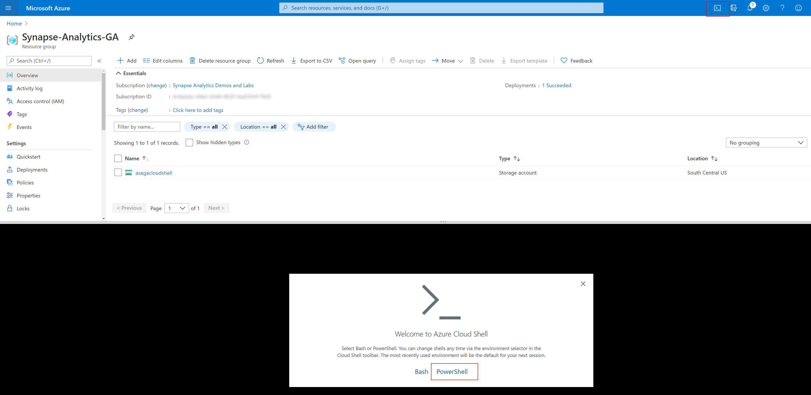
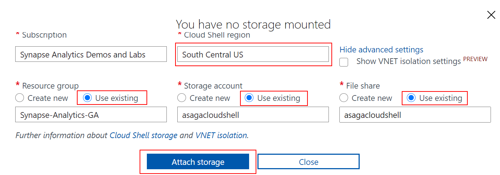
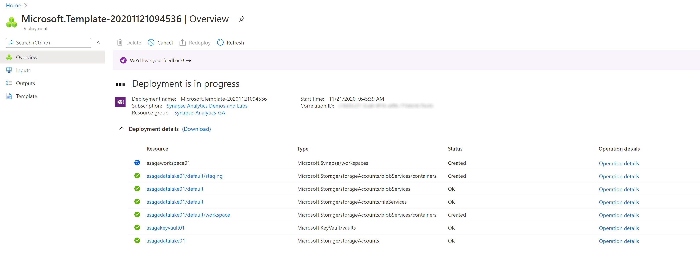

# Deploy your Azure Synapse Analytics workspace

## Pre-requisites for deployment

The following requirements must be met before the deployment:

- A resource group created in the `South Central US` region (this will be provided during the deployment process).

    >**IMPORTANT**
    >
    >In case you didn't create the resource group yourself, make sure your account has the `Owner` role on the resource group.
    >
    >Also, your account (i.e. the Azure AD account used to deploy the Azure Synapse Analytics workspace) must have permissions to create new resource groups in the subscription (this is required because Synapse Analytics requires an additional resource group to keep various hidden artifacts; this resource group is created during the deployment process).

- A unique suffix to be used when generating the name of the workspace. All workspaces deployed using the templates in this repo are named `asagaworkspace<unique_suffix>`, where `<unique_suffix>` gets replaced with the value you provide. Make sure the unique suffix is specific enough to avoid potential naming collisions (i.e. avoid using common values like `01`, `1`, `test`, etc.). Make sure you remember the unique suffix as you need to use it for additional configuration once the Azure Synapse Analytics workspace deployment is complete.
- A password for the SQL admin account of the workspace. Make sure you save the password in a secure location (like a password manager) as you will need to use it later.

## Configure the Azure Cloud Shell

>**NOTE**
>
>If Cloud Shell is already configured, you can skip this section entirely and advance to [Deploy the Synapse Analytics workspace](#deploy-the-synapse-analytics-workspace).

In the Azure Portal, navigate to your resource group and create a new storage account to be used in the Cloud Shell configuration process (make sure the resource type you create is `Storage account`). In the newly created storage account, select `File shares` (under the `File service` settings group) and create a new file share.

Next, select the Cloud Shell icon (located in the top right part of the page) and then select `PowerShell`:

Select your subscription under `Subscription` if it's not already selected, and then select `Show advanced settings`:

Provide values for the following fields:

- **Cloud Shell region**: the same region as the region of your resource group.
- **Resource group**: select `Use existing` and then select you resource group from the list.
- **Storage account**: select `Use existing` and then select the storage account you created above.
- **File share**: select `Use existing` and then select the file share you created above.

Select `Attach storage` once all the values are in place.

Once configuration is complete, you should get an instance of Cloud Shell:

## Deploy the Synapse Analytics workspace

Click the `Deploy to Azure` button below to start the deployment process.

You should see next the `Customer deployment` screen where you need to provide the following (see [Pre-requisites for deployment](#pre-requisites-for-deployment) above for details):

- The resource group where the Synapse Analytics workspace will be deployed.
- The unique suffix used to generate the name of the workspace.
- The password for the SQL Administrator account.

Select `Review + create` to validate the settings.

Once the validation is passed, select `Create` to start the deployment. You should see next an indication of the deployment progress:

Wait until the deployment completes successfully before proceeding to the next step.

## Tag your resource group with the unique suffix

In the Azure Portal, navigate to the resource group you used to deploy the Synapse Analytics workspace (see [Pre-requisites for deployment](#pre-requisites-for-deployment) above for details).

Select the `Tags` section and add a new tag named `DeploymentId`. Use the unique suffix as the value of the tag and then select `Apply` to save it.

The deployment of your Synapse Analytics workspace is now complete. Next, you will deploy the artifacts required by the labs into the newly created Synapse Analytics workspace.